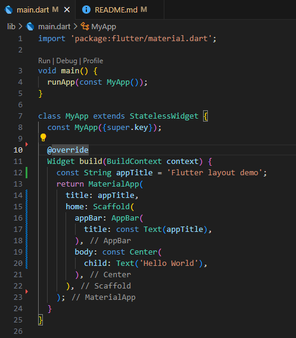
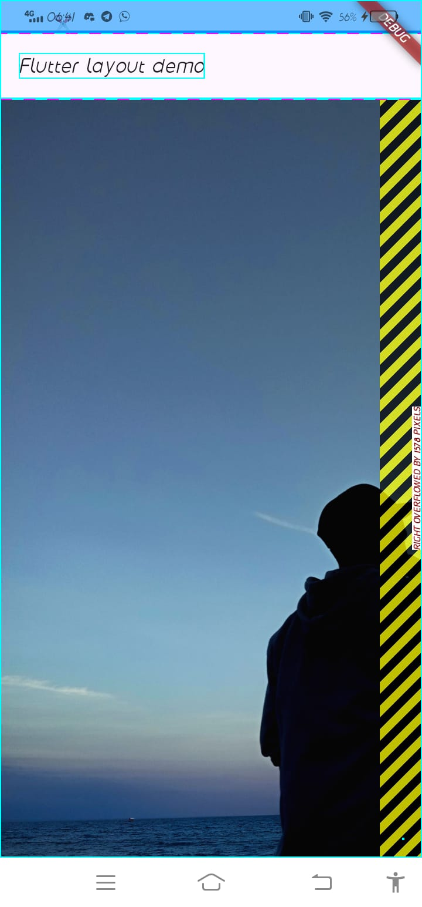
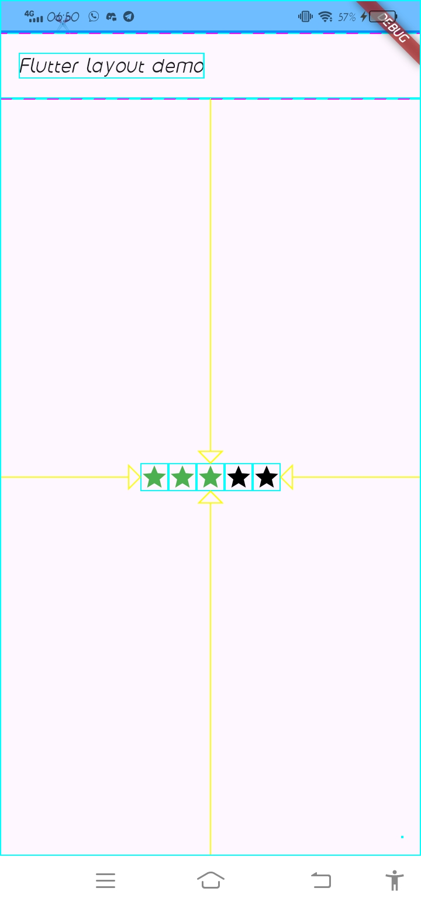
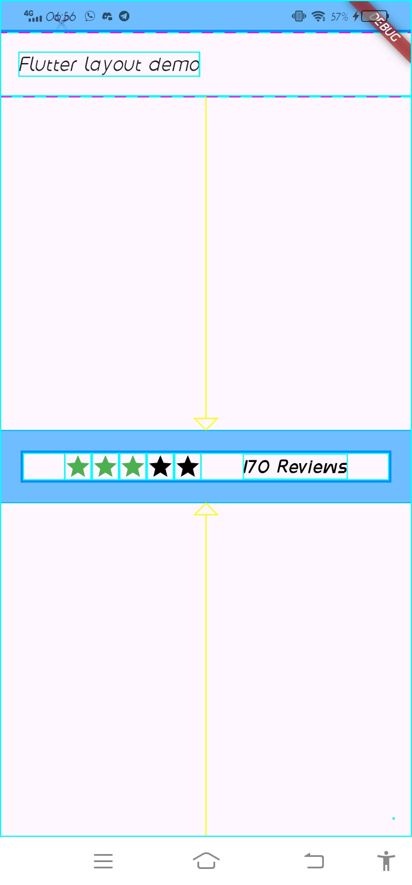

## Material Apps

## Cupertino Apps

## Non-Material Apps

## Build Row

## Build Column

## Sizing Widgets
Tampilan gambar setelah diberi widget Expanded
1. Row

2. Column

## Rating Widgets

## multiple widgets vertically and horizontally

## Icon List

## Build List

## Build Stack

## Build Card

## Tampilan akhir setelah digabungkan

## Referensi
[https://docs.flutter.dev/ui/layout]